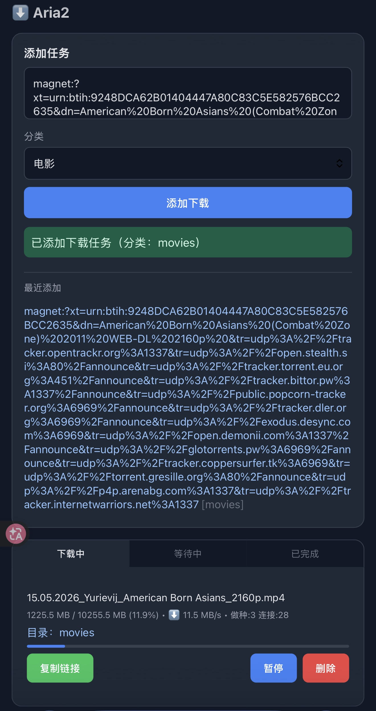

# Aria2 WebUI Mini

一个为 Minis / iOS / 小屏设备优化的极简 Aria2 Web 管理界面。

## 截图



## 特性

- 直接添加 HTTP / 磁力链接
- 下载中 / 等待中 / 已完成 三标签
- 实时显示进度、速度、连接数
- 暂停 / 继续 / 删除
- 复制原始链接
- 分类下拉（movies / tv / music / software / books / other）
- 最近添加记录（最近 10 条，支持默认收起/展开）
- 点击最近记录可自动回填链接与分类
- 任务显示所属目录
- 目录名超长时自动省略显示，避免撑出页面
- 适合和 File Browser 联动使用
- 移动端按钮优化（复制链接 / 暂停 / 删除）

## 目录结构

- `index.html`：前端页面
- `screenshot-mobile.jpg`：移动端截图
- `caddy/Caddyfile.snippet`：Caddy 反代片段
- `scripts/deploy.sh`：示例部署脚本
- `scripts/update.sh`：示例更新脚本

## 使用要求

- 一个可访问的 Aria2 JSON-RPC
- 建议用 Caddy / Nginx 反代 `/jsonrpc`
- 建议 File Browser 挂载同一下载目录

## 示例 RPC 配置

- RPC URL: `/jsonrpc`
- Secret: 由你的部署环境决定

## 典型目录约定

```text
/downloads/incoming
/downloads/movies
/downloads/tv
/downloads/music
/downloads/software
/downloads/books
/downloads/other
```

## 适用场景

- 自建下载中心
- iPhone / iPad Safari 远程下载管理
- 与 qBittorrent / File Browser 并存
